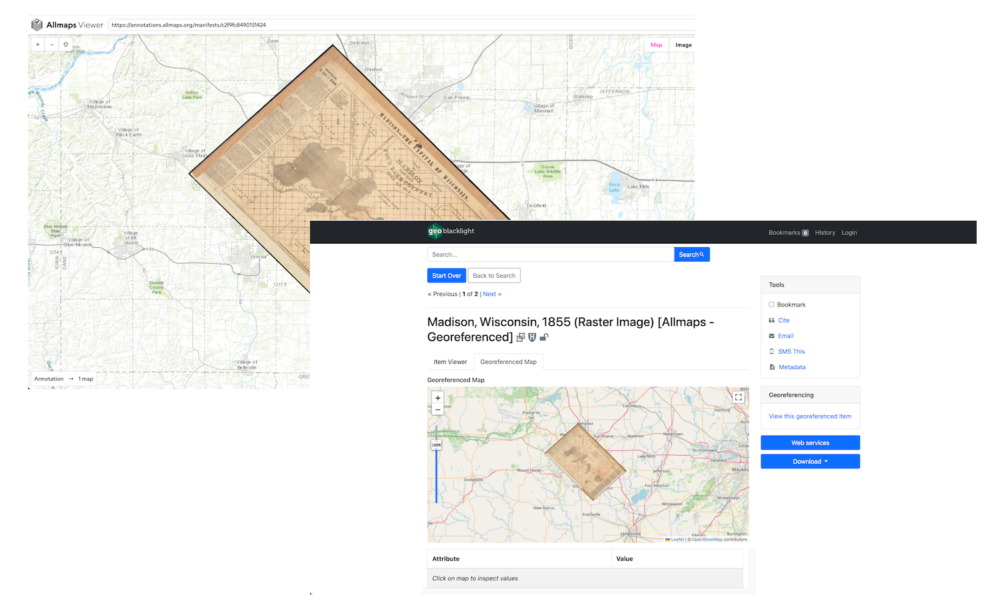
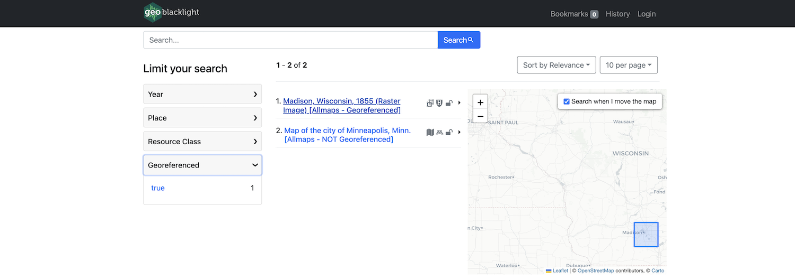

# Blacklight::Allmaps

 

  

A [Blacklight](https://projectblacklight.org/) / [GeoBlacklight](https://geoblacklight.org/) plugin for including [Allmaps](https://allmaps.org/) georeferenced maps inside your application.



## Dependencies

* Blacklight v7 (v8 forthcoming)
* GeoBlacklight v4.1 (v4.2+ forthcoming)

## Installation
Add this line to your application's Gemfile:

```ruby
gem "blacklight_allmaps"
```

And then execute:
```bash
bundle
```

Run the install generator:

```bash
# For Blacklight...
LIGHT=blacklight bundle exec rails generate blacklight:allmaps:install

# For GeoBlacklight
LIGHT=geoblacklight bundle exec rails generate blacklight:allmaps:install
```

## Rake Tasks

### Harvest Allmaps IIIF Annotation Data

We harvest and store Allmaps IIIF Annotation data locally — see the Blacklight::Allmaps::Sidecar section below.

The rake task here kicks off a background harvest process that walks through your Solr index documents (using CursorMark) and checks each document for `georeferenceable?` - the presence of a IIIF Manifest. If the document is indeed georeferenceable? (true) we ping the Allmaps API to determine if the map/item has already been georeferenced in Allmaps.

```bash
rake blacklight_allmaps:sidecars:harvest:allmaps
```

### Populate the Georeferenced Facet

We expose the georeferenced items in the Blacklight user interface via a Georeferenced facet:



#### Blacklight

@TODO

#### GeoBlacklight

```bash
LIGHT=geoblacklight rake blacklight_allmaps:index:gbl_georeferenced_facet
```

## ActiveRecord Objects — Blacklight::Allmaps::Sidecar 

Blacklight::Allmaps adopts the SolrDocumentSidecar "sidecar" pattern from [Spotlight](https://github.com/projectblacklight/spotlight), adding an ActiveRecord object to the database for each SolrDocument object in the index.

The Blacklight::Allmaps::Sidecar object contains:

* id: primary key
* solr_document_id: solr document primary key
* document_type SolrDocument
* manifest_id: IIIF Manifest ID
* annotated: boolean (true|false)
* allmaps_id: Allmaps ID
* iiif_manifest: Copy of the IIIF Manifest
* allmaps_annotation: Copy of the Allmaps IIIF Annotation
* solr_version: solr document version number
* created_at: created at
* updated_at: updated at

```ruby
document.sidecar =>
#<Blacklight::Allmaps::Sidecar:0x0000000141991a50
 id: 1,
 solr_document_id: "harvard-g4124-m2-1855-m3",
 document_type: "SolrDocument",
 manifest_id: "https://ark.digitalcommonwealth.org/ark:/50959/4m90f9436/manifest",
 annotated: true,
 allmaps_id: "c2f9fc8490151424",
 iiif_manifest:
  "{\"@context\":\"http://iiif.io/api/presentation/2/context.json\",\"@id\":\"https://ark.digitalcommonwealth.org/ark:/50959/4m90f9436/manifest\",\"@type\":\"sc:Manifest\",\"label\":\"Map of Madison and the Four Lake Country, Dane Co. Wis\" ...
 allmaps_annotation:
  "{\n  \"type\": \"AnnotationPage\",\n  \"@context\": \"http://www.w3.org/ns/anno.jsonld\",\n  \"items\": [\n    {\n      \"id\": \"https://annotations.allmaps.org/maps/3740c2822f443181\",\n      \"type\": \"Annotation\",\n      \"@context\": [\n        \"http://iiif.io/api/extension/georef/1/context.json\" ...
 solr_version: 1794605692067250176,
 created_at: Tue, 26 Mar 2024 15:47:49.422826000 UTC +00:00,
 updated_at: Tue, 26 Mar 2024 16:39:42.427682000 UTC +00:00>
```

## Contributing

For Developer documentation see [doc/developer.md](./doc/development.md)

Additional Contribution directions to come...

## License
The gem is available as open source under the terms of the [Apache 2.0 License](https://opensource.org/license/apache-2-0).
